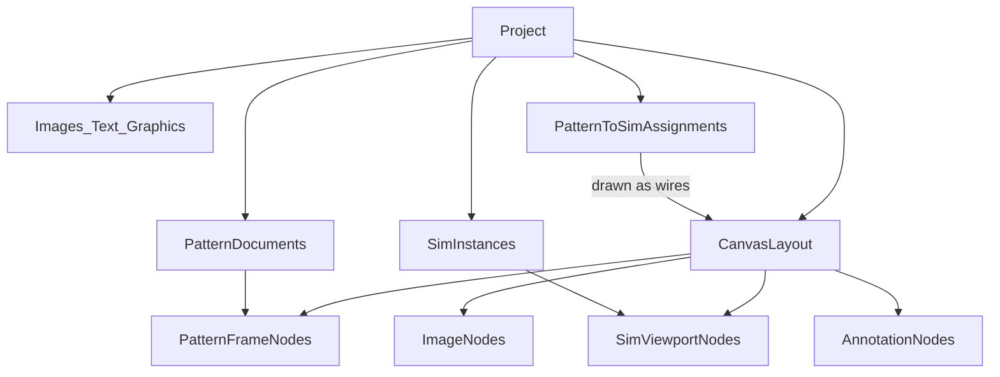
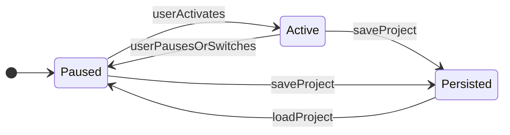

# patternCanvas — Product Requirements Document

**Status:** Draft v0.1  
**Product:** patternCanvas  
**Audience:** Indie makers, students, hobbyists, researchers  
**Platform:** Browser-first (WebGPU)

---

## 1. Vision & problem

patternCanvas is a browser studio for drafting garment patterns in real units, draping them with interactive cloth simulation, and arranging those studies on an open canvas—alongside images, notes, and snapshots—the way a designer’s table holds small experiments next to a larger piece.

It is **not** a Marvelous Designer or CLO competitor. Controls may feel familiar where that helps learning and experimentation, but the product optimizes for inspectable physics, remixable studies, and historical / experimental exploration rather than production fashion pipelines.

**North-star scenario:** Several pattern frames and sim viewports live on one pannable board. Wires show which patterns feed which sims. A sleeve-gather study is copied into a larger garment sim. A historical plate sits as an image beside an annotated drape snapshot. Only one sim runs at a time; the rest hold paused poses.

---

## 2. Users & jobs-to-be-done

| User | Jobs |
| --- | --- |
| Student | See how seams, ease, and gather change drape |
| Hobbyist | Draft a simple garment and drape it on a body reference |
| Researcher | Redraw or overlay historical patterns; test construction hypotheses; annotate findings |
| Experimental designer | Fork studies, A/B sims, collage successful bits into larger pieces |

---

## 3. Product principles

1. **Canvas is the document** — patterns, sims, images, and notes are peers on one board.
2. **Real units** — canonical storage in cm; display in cm or inches.
3. **One active sim** — pause/persist is cheap and trusted; no parallel physics.
4. **Drape-first** — resting pose fidelity over animation timelines.
5. **Studies inform pieces** — copy/paste and reassignment over monolithic single-garment silos.
6. **Honest physics** — readable controls preferred to opaque “fabric magic.”
7. **Progressive complexity** — one panel works before a dense multi-sim board.

---

## 4. Domain model

| Concept | Meaning |
| --- | --- |
| **Project** | Top-level save unit: canvas layout + patterns + sims + assets + assignments |
| **Canvas** | Pannable/zoomable board hosting nodes |
| **Pattern document / frame** | Editable 2D pattern design shown as a canvas frame |
| **Pattern piece** | Closed outline (bezier and/or polyline) with edges, points, optional grainline |
| **Linked / mirrored piece** | Duplicate with transform + edit link (or break link) |
| **Seam binding** | Paired edge intervals that become cloth sew constraints |
| **Stitch / gather line** | Curve whose rest length can be shortened to gather |
| **Sim instance** | Cloth world: avatar, arrangement, params, paused/active pose |
| **Sim viewport** | Canvas node that renders a sim instance |
| **Assignment** | Link from pattern document(s) → sim instance; drawn as wires on the canvas |
| **Snapshot image** | Raster capture of a sim viewport placed on the canvas |
| **Annotation** | Text or graphic markup on the canvas |
| **Mesh** | Real-time triangulation / particle mesh of assigned pieces for a sim |
| **Avatar** | Body collider used for draping |

---

## 5. Architectural constraints (`ARCH-*`)

These apply from day one so early builds do not paint into a single-sim corner.

| ID | Requirement | Priority |
| --- | --- | --- |
| **ARCH-01** | A **Project** is an open canvas document. Nodes include pattern frames, sim viewports, images, and text/graphic annotations. | MUST |
| **ARCH-02** | A project supports **N sim instances**. Exactly **one** sim may be **active** (stepping physics) at a time. | MUST |
| **ARCH-03** | User can **pause** the active sim and **persist** particle/pose state into the project; resume restores that state. Switching active sim pauses/persists the outgoing sim. | MUST |
| **ARCH-04** | Pattern documents can be **assigned** to sims. Assignments are **visualized** on the canvas (wires/edges between frames and viewports). | MUST |
| **ARCH-05** | User can **snapshot** the current view of a sim viewport as a raster **Image** node on the canvas. | MUST |
| **ARCH-06** | Project serialization round-trips: canvas layout, patterns, sim states + cameras, images, annotations, and the assignment graph. | MUST |
| **ARCH-07** | Persistence is **drape-oriented** (pose + params). Animation geometry caches / playback scrubbing are out of scope until a later phase. | MUST |

**Figma analogy:** Pattern frames sit beside sim viewports the way 2D frames sit beside live embeds; images and text annotations complete the board.

---

## 6. Functional requirements by phase

### MVP — Canvas project + single active drape path

| ID | Requirement | Priority |
| --- | --- | --- |
| **PAT-01** | Create/edit bezier (and polyline) points on a pattern piece via Figma-aligned **Move**, **Pen**, and **Bend** tools. | MUST |
| **PAT-02** | Display segment lengths and point coordinates; global **cm / inches** toggle (store cm). | MUST |
| **PAT-04** | Pattern frames support the same view navigation as the project canvas: **⌘/Ctrl-wheel zoom** (toward cursor) and **Alt-drag pan** inside the pattern viewport. | MUST |
| **MESH-01** | Real-time mesh generation from a closed piece into a cloth particle mesh suitable for sim, exposed as a canvas **Mesh** node between Pattern and Sim with top-down preview, density, and algorithm controls. | MUST |
| **SEW-01** | Bind two edges (or edge intervals) as sew constraints. | SHOULD |
| **SIM-01** | Place/arrange cloth relative to a simple body collider (sphere or basic humanoid stand-in); run/pause; orbit camera. | MUST |
| **SIM-CTRL-01** | Expose resolution, spring, damping, mass, gravity, wind-style detail controls. | MUST |
| **ARCH-01…07** | As above (canvas, multi-sim model, one active, pause/persist, assignments+wires, snapshot, serialize). | MUST |
| **ANNO-01** | Basic text annotation nodes on the canvas. | MUST |

### V1 — Construction craft + richer board

| ID | Requirement | Priority |
| --- | --- | --- |
| **SYM-01** | Mirror / linked duplicate of pattern pieces; unlink supported. | MUST |
| **SEW-02** | Multi-piece garments with multiple seam bindings. | MUST |
| **GAT-01** | Draw stitch/gather lines; set gather ratio or target length; sim shortens rest length along that curve. | MUST |
| **SIM-CTRL-02** | Fuller detail panel: substeps/oversamples, collision margin, self-collision toggle, bend group when available. | MUST |
| **PAT-03** | SVG outline import; image underlay for tracing; measurement overlay. | SHOULD |
| **STUDIO-01** | Copy/paste pattern bits and selected draped piece instances between sims. | MUST |

### Studio — Experimental + historical workflows

| ID | Requirement | Priority |
| --- | --- | --- |
| **STUDIO-02** | Dense multi-viewport boards; fork sim state; A/B assignment variants. | MUST |
| **HIST-01** | Historical pattern packs / templates as canvas starting points. | SHOULD |
| **STUDIO-03** | Promote a small study into a larger garment assembly with minimal rework. | MUST |

---

## 7. Non-functional requirements

- Browser-first; WebGPU with a clear message when unavailable.
- Only one sim stepping bounds CPU cost by design; paused viewports present cheaply (static pose or retained framebuffer).
- Project files remain practical with several paused poses + snapshots.
- Undo/redo for canvas and 2D edits (assignments included) — SHOULD in MVP, MUST in V1.
- Educationally plausible cloth, not certified textile science.

---

## 8. UX outline

- Infinite (or large) pannable/zoomable canvas.
- Visible wires for pattern↔sim assignments; selection emphasizes related nodes.
- Clear **active** chrome on the running sim viewport; others show paused.
- Snapshot control on viewport chrome.
- Focus modes: edit inside a pattern frame (CAD); focus a sim viewport (orbit/arrange), analogous to embedded live objects in a design tool.
- Pattern frames expose a side tool strip (Move / Pen / Bend) and zoom/pan matching the board.

---

## 8a. Pattern vector tools (Figma-aligned)

Reference: [Figma — Edit vector layers](https://help.figma.com/hc/en-us/articles/360039957634-Edit-vector-layers). Pattern editing follows Figma’s pen/bend model so designers already familiar with Figma can draft outlines without learning a separate CAD idiom.

### Tools

| Tool | Shortcut (target) | Behavior |
| --- | --- | --- |
| **Move** | V | Select and drag anchors. Selected points show Bézier handles when present. Dragging an anchor moves its handles with it. |
| **Pen** | P | Click places a **corner** point. Click-drag places a point and pulls out **mirrored** handles (smooth curve). Click the **first point** again to **close** the path. **Alt-click** a point deletes it (when the piece has more than two points). |
| **Bend** | (toolbar) | Click a corner to add default Bézier handles. Drag handles to reshape; **Alt-drag** a handle moves it independently (break mirror). **⌘/Ctrl-click** an anchor removes handles (convert to corner). Click near a segment midpoint to bend that edge (pull handles toward the click). |

### Handle mirroring

Aligned with Figma’s mirroring modes for MVP:

- **Default while dragging a handle:** mirror angle and length (opposite handle stays opposite).
- **Alt while dragging:** no mirroring — independent handles (Figma “disconnected” / independent control).
- **⌘/Ctrl-click on anchor:** clear both handles → corner point.

### View navigation inside pattern frames

Same modifiers as the project canvas so muscle memory carries over:

- **⌘/Ctrl + scroll wheel** — zoom toward cursor
- **Alt + drag** on empty space — pan the pattern view

### Out of scope for this pass

- Full Figma vector networks (multiple paths sharing vertices)
- Paint bucket / boolean shape builder
- Stroke width profiles
- Keyboard shortcuts fully wired (toolbar is authoritative; shortcuts MAY follow)

---

## 9. Success metrics

| Phase | Bar |
| --- | --- |
| MVP | One project with pattern + sim + annotation + snapshot; save/reopen with pose intact; one-active rule holds with ≥2 sim nodes |
| V1 | Two sims on canvas with assignments; gather + mirror; switch active with both poses preserved |
| Studio | Copy a draped study into a larger sim without rebuilding the board from scratch |

---

## 10. Non-goals

- Marvelous Designer / CLO feature parity
- Manufacturing BOM, nested marker making, full ASTM/PLM
- Mobile-first editing
- Guaranteed physically accurate textile science
- Animation timeline / geometry cache / playback scrubbing (deferred)
- Running multiple sims simultaneously

---

## 11. Open questions & risks

- WebGPU multi-viewport presentation: shared device/renderer vs per-viewport surfaces; snapshot path
- Policy when assigned pattern edits invalidate a paused drape (confirm vs auto-remesh)
- Embedded vs externally referenced images in the project file
- Solver evolution (mass-spring → XPBD/PBD) for seam/gather stability
- Self-collision cost in-browser
- Avatar sourcing/licensing for historical body types

---

## 12. Relationship to current codebase (Phase 0)

The repository began as a WebGPU cloth demo (CPU mass-spring, render-only GPU). Reusable foundations:

- `src/Cloth.ts`, `src/SimpleCloth.ts` — particle cloth stepper
- `src/Renderer.ts`, `src/shaders/*` — WebGPU draw path
- `src/physics/*` — particles, springs, aero triangles
- `src/Camera.ts`, ground/sphere colliders

Greenfield for MVP+: project document model, open canvas UI, pattern editor, assignment graph, pause/persist serialization, pattern→mesh path, sew/gather, multi-viewport orchestration.

Legacy demo remains available via `demo.html` for regression and comparison.
